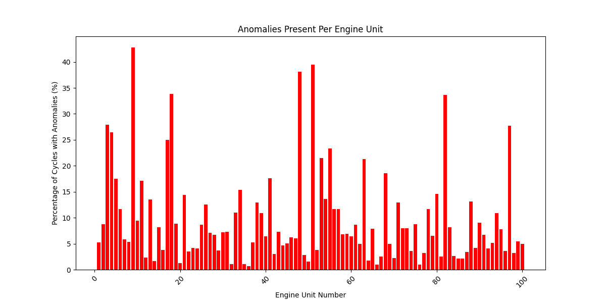

# 🚀 Predictive Maintenance Program

This project analyzes sensor data from NASA's C-MAPSS dataset to detect engine anomalies using statistical methods. The goal is to help predict critical degradation of engine components.

---

## 📁 Dataset

**Source:** NASA C-MAPSS FD001 Dataset

Each record represents an engine unit over multiple sensor cycles with the following:

- `unit_number`: Unique ID per engine
- `time_in_cycles`: cycle count
- `operational_setting_1-3`: Engine settings
- `sensor_1` to `sensor_21`: Sensor readings

---

## ⚙️ Project Workflow

### 1. **Load and Preprocess Data**

- Load the raw text file.
- Assign column names..

### 2. **Anomaly Detection Using Z Scores**

- Calculate Z scores for each sensor.
- Flag values with an absolute value of the z score > `3` as anomalies.
- Append anomaly flags to the new df with column names.

### 3. **Anomaly Summary Per Engine**

- Grouping by `unit_number`.
- Aggregate sum of cycles for anomalies on each engine.
- Calculate the percentage of anomalies of cycles per engine.
- Create a bar plot to visualize the data.

---

## 📊 Visualization

A bar plot shows the **percentage of cycles with anomalies per engine**, helping highlight which engines have a higher variation in data.

---

## 🧠 Key Takeaways

- **Z-Score Method** is effective for identifying unusual sensor readings.
- **Engines with a high anomaly percentage** are potential candidates for maintenance.
- Supports **predictive maintenance decisions**, reducing downtime and costs.

---

## 📂 Output Files

- `flagged_FD001_data.csv`: Raw data with anomaly flags per sensor.
- `anomaly_percentage_per_unit.png`: Visual chart of anomaly rates per engine.

---

## 🛠️ Libraries

- **Pandas / numpy** for data manipulation
- **SciPy** for statistic calculations
- **Matplotlib** for visualization